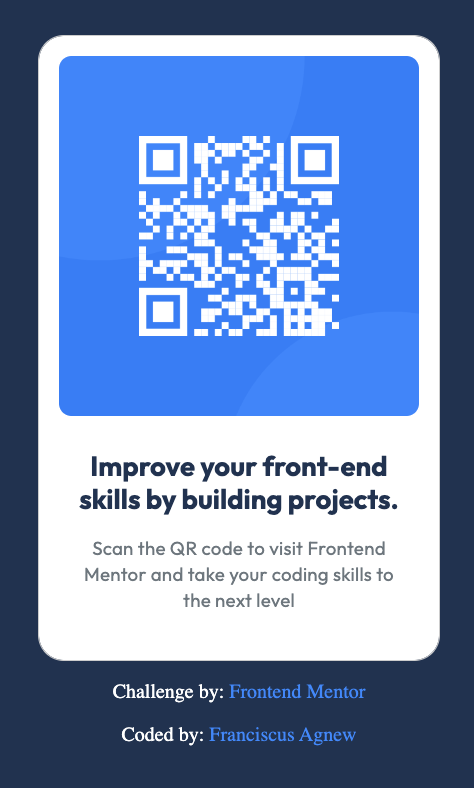

# Frontend Mentor - QR code component solution

This is a solution to the [QR code component challenge on Frontend Mentor](https://www.frontendmentor.io/challenges/qr-code-component-iux_sIO_H). Frontend Mentor challenges help you improve your coding skills by building realistic projects.

## Table of contents

- [Overview](#overview)
  - [Screenshot](#screenshot)
  - [Links](#links)
- [My process](#my-process)
  - [Built with](#built-with)
  - [What I learned](#what-i-learned)
  - [Continued development](#continued-development)
  - [Useful resources](#useful-resources)
- [Author](#author)

**Note: Delete this note and update the table of contents based on what sections you keep.**

## Overview

### Screenshot



### Links

- Solution URL: [QR-Code Solution URL](https://franciscusagnew.github.io/qr-code-component/)

## My process

### Built with

- Semantic HTML5 markup
- CSS custom properties
- CSS Grid
- Mobile-first workflow

### My Feedback

This was my first challenge with Frontend Mentor, I found myself thinking... what a wonderful concept & service they have provided myself and others like me who are passionate, motivated, & constantly curious about web development & its steady evolution.

I had a lot of fun completing this challenge! I initially considered integrating [TailwindCss](https://tailwindcss.com/), [React](https://react.dev/) & [TypeScript](https://www.typescriptlang.org/) for my solution, but decided to use only semantic HTML, CSS, & a simple layout using CSS grids.

```html
<div class="card">
  

  <div class="card-content">
    <p class="card-title">
      Improve your front-end skills by building projects.</p>
    <p class="card-body">
      Scan the QR code to visit Frontend Mentor and take your coding skills to the next level</p>
  </div>
</div>
```
```css
.container {
    display: grid;
    grid-template-columns: auto;
    grid-template-rows: auto;
    grid-template-areas: 'card';
    grid-template: "card" "footer";
    justify-content: center;
}

.card {
    grid-area: card;
    background-color: hsl(0, 0%, 100%);
    width: 320px;
    height: 499px;
    border-radius: 20px;
    box-sizing: border-box;
    padding: 16px 16px 40px;
    outline: 1px solid hsl(0, 0%, 80%);
    box-shadow: 5 5 5px 0 hsl(0, 0%, 80%);
    max-height: 499px;
    max-width: 320px;
}

.footer-container {
    width: 320px;
    grid-area: footer;
}
```

### Continued development

I love honing my skills & constantly learning new techniques, resources, & practices to inhance my knowledge of web & software development.

I have found that having a greater understanding, appreciation, & talent towards working on projects that involves a UX, UI design process before approaching the development process is a more effective, efficient, productive, & rewarding experience for all developers to adopt.

It allows developers to empathize, view, & work on the whole process alongside designers with a broader & more humbling approach & perspective. So, I highly recommend developers learn [UX](https://www.nngroup.com/) & [UI](https://www.interaction-design.org/literature/topics/ui-design) concepts, tools, & practices along with getting skilled at using & intergrating [Figma](https://www.figma.com/)

## Author

- Linkedin - [Franciscus Agnew](https://www.linkedin.com/in/franciscusagnew/)
- Frontend Mentor - [@Franciscus Agnew](https://www.frontendmentor.io/profile/franciscusagnew)